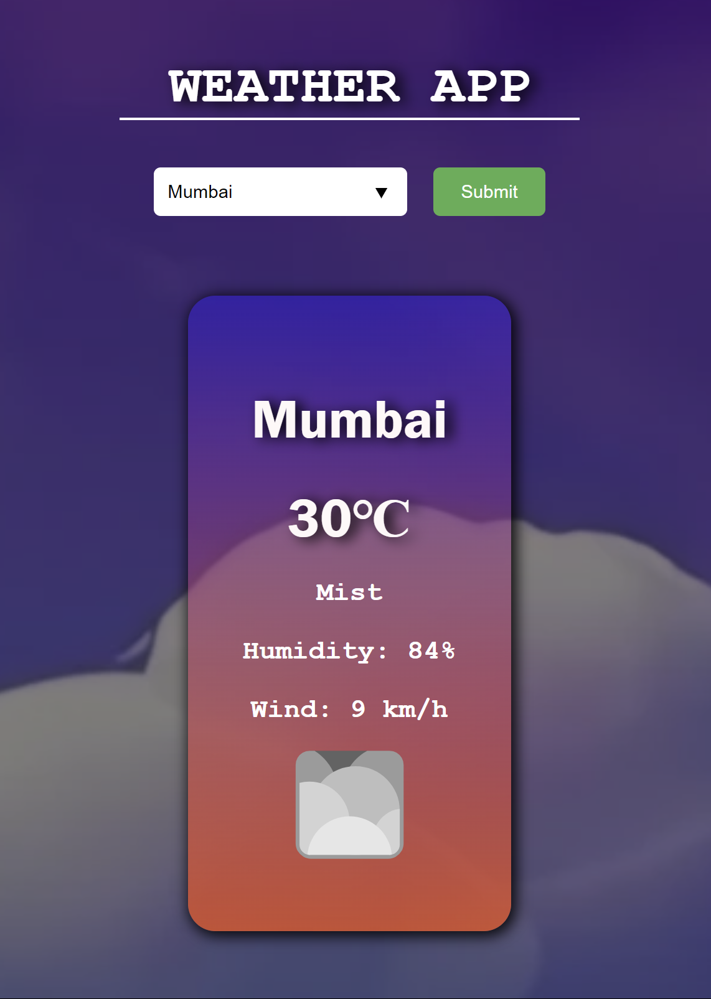
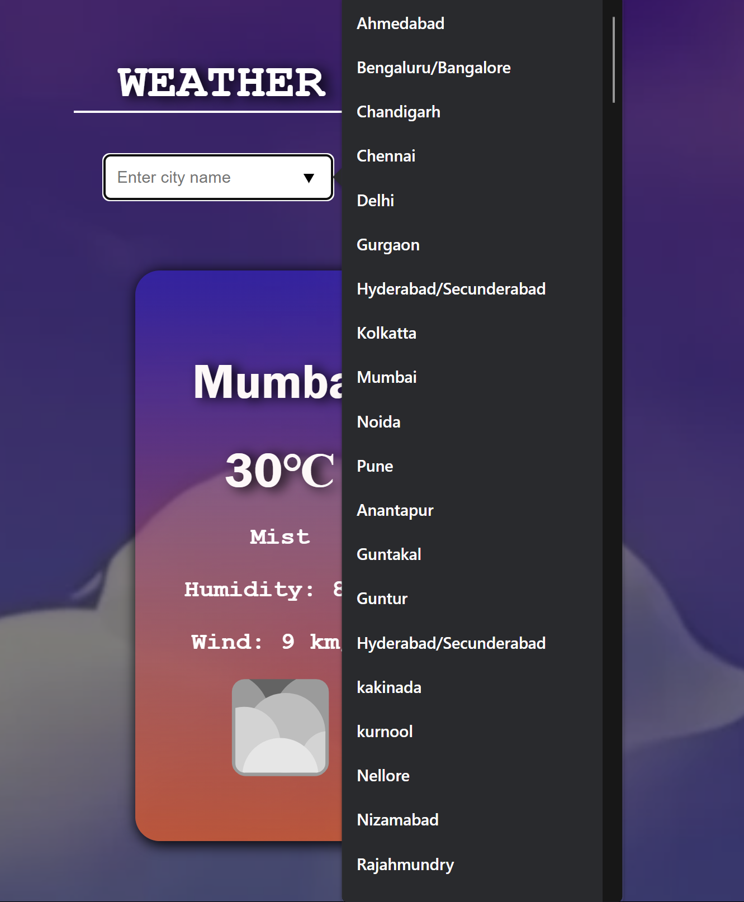
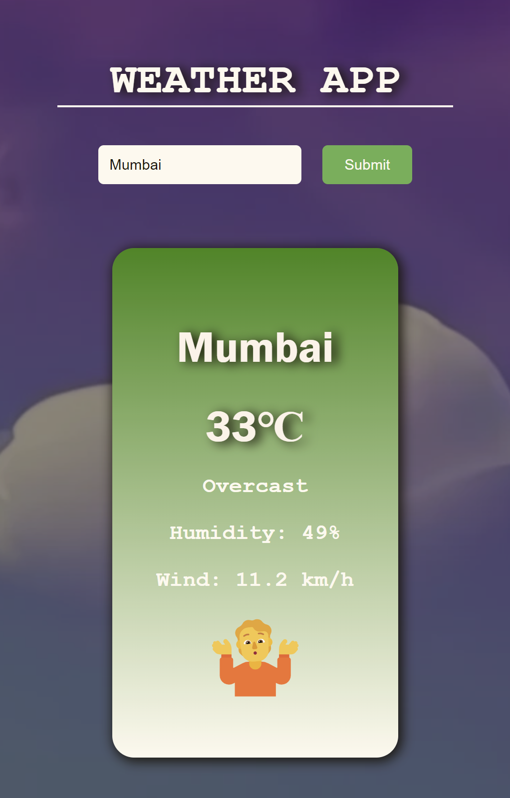
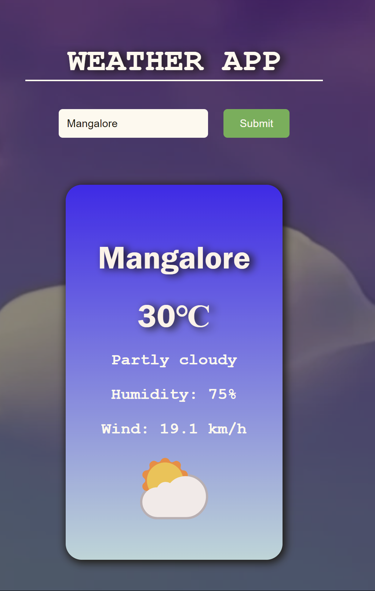
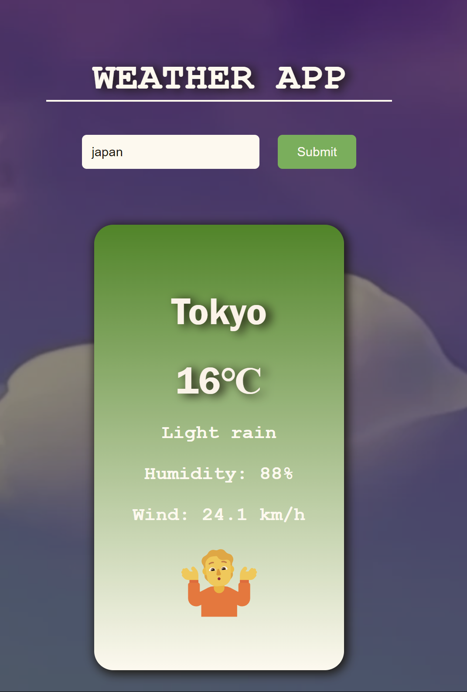
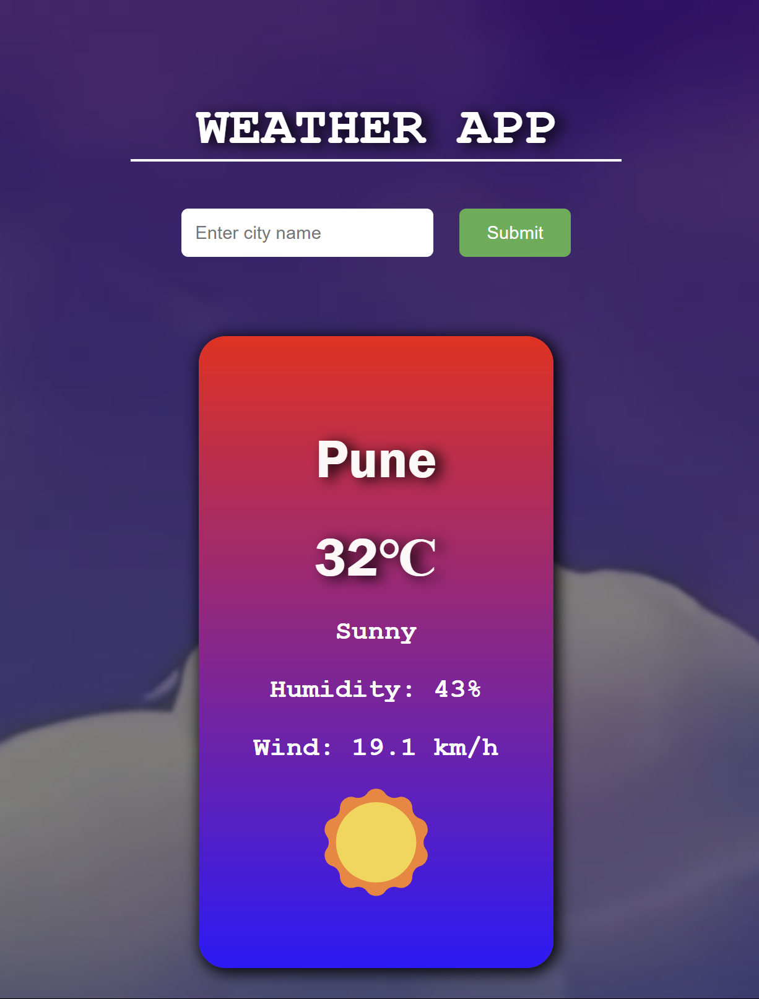

# Weather App
<div style="display:grid;grid-template-column:30% 30% 30% >






</div>

## Overview
The Weather App is a simple web application that provides users with current weather information for a specific location. Users can enter the name of a city or location, and the app will retrieve and display the current weather conditions, including temperature, humidity, wind speed, and weather description.

## Features
- **Weather Information**: Users can view the current weather conditions for a selected city or location.
- **Search Functionality**: Users can search for weather information by entering the name of a city or location.
- **Responsive Design**: The app is designed to work seamlessly across different devices and screen sizes.

## Technologies Used
- HTML
- CSS
- JavaScript
- rapid api

## Usage
1. Clone or download the repository to your local machine.
2. Open the `index.html` file in a web browser.
3. Enter the name of a city or location in the provided input field.
4. Press the "Search" button or hit Enter to retrieve weather information.
5. The app will display the current weather conditions for the specified location.

## Configuration
To use the OpenWeather API, you need to sign up for an API key on rapid API. Once you have an API key, replace `"YOUR_API_KEY"` in the `script.js` file with your actual API key.

```javascript
const apiKey = "YOUR_API_KEY";
